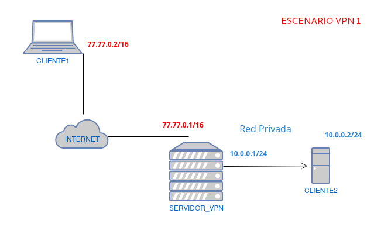

# Vagrant
Repositorio para trabajar sobre Vagrant

# [Escenario1](escenario1/Vagrantfile)
_Escenario sencillo con Debian 11 Bullseye y sin servidor NFS_

# [Escenario2](escenario2/Vagrantfile)
_En construcción_

# [Escenario 3](escenario3/Vagrantfile)
_Escenario previo para una siguiente modificación que se hará con Ansible. En este Vagrantfile se crean dos máquinas Router-Cliente con una red que conecta a un switch virtual y otra privada que interconecta a dichas máquinas._

# [Vagrant-Ansible](vagrant-ansible(escenario3))
_Escenario igual al escenario3, pero añadiendo configuraciones con ansible._

# [Vagrant-DNS](Vagrant_DNS)
_Escenario básico para prueba de varias configuraciones de DNS con bind9._

# [Vagrant-VPN](Vagrant_VPN)
_Escenarios básicos para pruebas de configuraciones distintas de VPN._

## [VPN1](Vagrant_VPN/VPN1)

